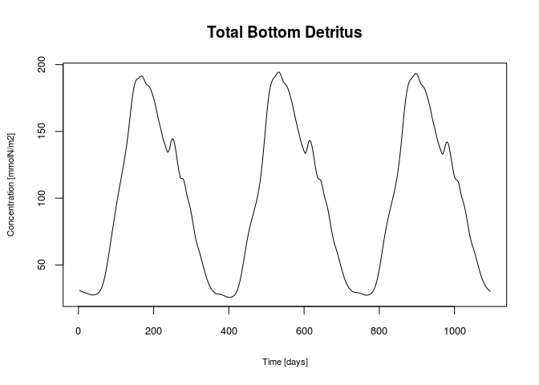
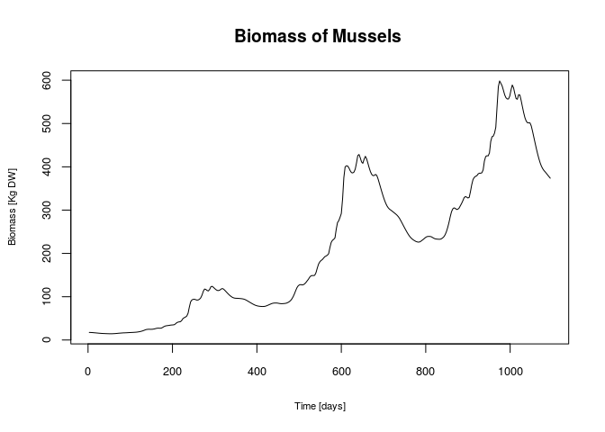
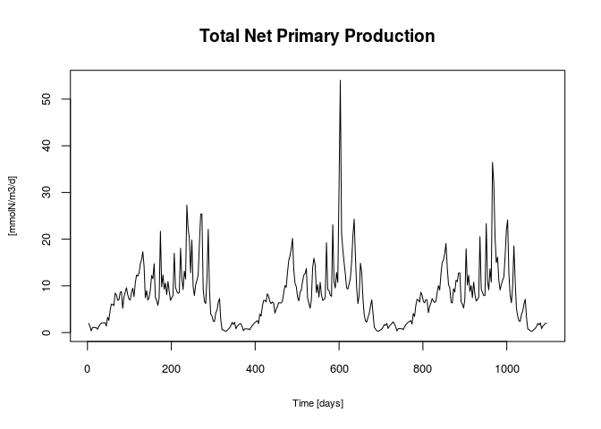
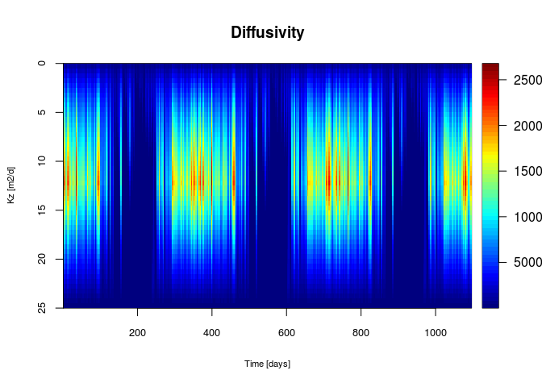
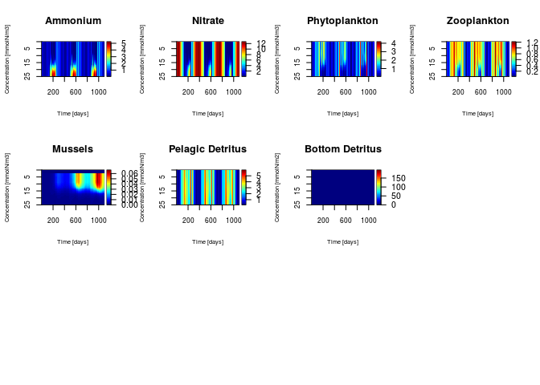
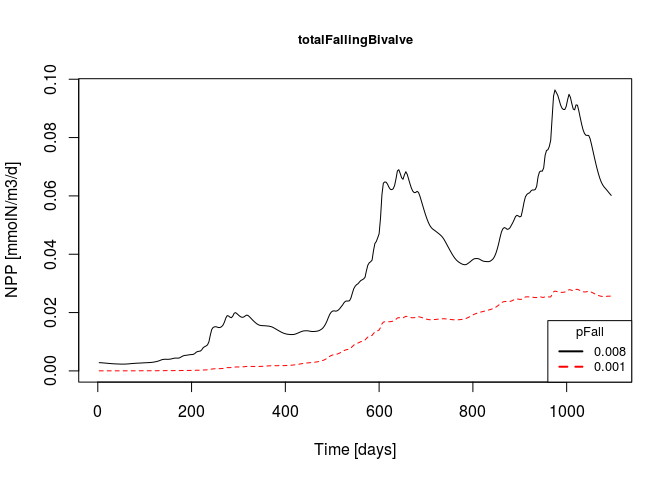
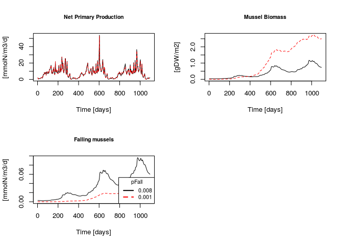
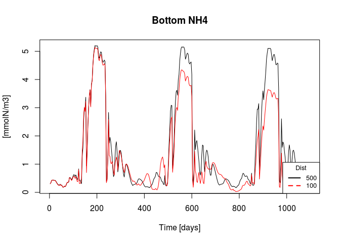
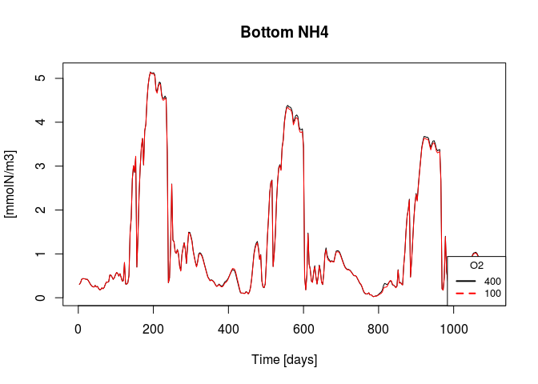
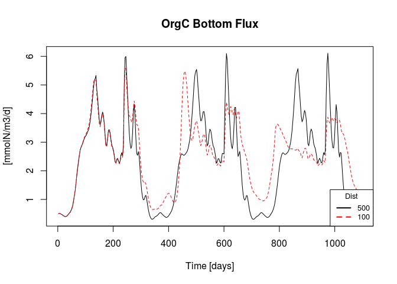

Mussel OWF model : Practical Sessions
================
Arthur Capet, Laura Vittoria De Luca, Karline Soetaert
October 1, 2019

-   [Context](#context)
-   [Packages](#packages)
-   [Grid](#grid)
-   [Forcings](#forcings)
-   [Model parameters](#model-parameters)
-   [Initial conditions](#initial-conditions)
    -   [First Guess Initial Conditions](#first-guess-initial-conditions)
-   [Model formulation](#model-formulation)
-   [Model Solution](#model-solution)
-   [Plotting State Variables](#plotting-state-variables)
-   [Plotting Diagnostics](#plotting-diagnostics)
-   [Plotting Forcing Conditions](#plotting-forcing-conditions)
-   [Alternative Simulations](#alternative-simulations)
-   [Exercices](#exercices)
    -   [Sensitivity to parameters.](#sensitivity-to-parameters.)
    -   [Sensitivity to forcing.](#sensitivity-to-forcing.)
    -   [Defining New diagnostics.](#defining-new-diagnostics.)

Context
=======

-   Simple NPZD model including Bivalves (assumed that bivalves that fall are dead)
-   **Units**: mmol nitrogen/m3 , time unit = days
-   **Thesis**: Modelling the shadow effect caused by the growth of the blue mussel Mytilus edulis on offshore wind farms in the North Sea
-   **Implementation** : Karline Soetaert & Laura Vittoria De Luca (Source: Meire et al. (2013))

Packages
========

`ReacTran` is a package providing a framework to implement and solve Reaction-Transport models.

``` r
# Load packages
require(ReacTran)
```

    ## Loading required package: ReacTran

    ## Loading required package: rootSolve

    ## Loading required package: deSolve

    ## Loading required package: shape

Grid
====

`setup.grid.1D` is a function from the `ReacTran` package. It allows to define grid with different options, such as size, spatial increment, grid refinement on top or bottom, etc ..

``` r
# Define grid
N <- 50 # Number of cells in system (-)
L <- 25 # Depth of system (m)
grid <- setup.grid.1D(x.up = 0, L = L, N = N) # Build grid
```

Forcings
========

Forcings used to constrain process rates includes :

-   Turbulent diffusion coefficient : used to compute diffusion transport.
-   Temperature : used to constrain biogeochemical rates.
-   Light at the surface : Used to constrain photosynthesis.

Those informations were extracted from an *offline* (independant) simulations of a 1D physical model, and stored within .csv files. Two data sets were prepared, for **mixed** and **stratified** conditions. The `Mixed` parameter (0 or 1) allows to switch between data sets.

*! Be sure you set the working directory to a repertory in which both .Rmd and .csv forcing files are presents !*

``` r
Mixed= 1        # Determines mixed or stratified conditions

# Read forcing functions
# Stratified conditions
if (Mixed==0) {
  Kzdata    <- as.matrix(read.csv("KzS.csv"))
  Tempdata  <- as.matrix(read.csv("TemperatureS.csv"))
  Variables <- read.csv("Variables.csv") # Variables
  ffDays    <- Variables$Time
  } else {
  Kzdata    <- as.matrix(read.csv("KzM.csv"))
  Tempdata  <- as.matrix(read.csv("TemperatureM.csv"))
  Variables <- read.csv("Variables.csv") # Variables
  ffDays    <- Variables$Time
  }
```

Model parameters
================

Model *parameters* are stored in a vector `parms`. R allows to provide names to elements of the vectors, so that a given parameters can be accessed using his name, eg. `parms['maxUptake']`.

``` r
# Parameter
parms <- c(

  # PARAMETERS FOR LIGHT PENETRATION
  kP                = 0.029, # [/mmolN m-3]  Extinction coefficient of Biota
  kW                = 0.198, # [/m]          Extinction coefficient of Water
  
  # PARAMETERS FOR PHYTOPLANKTON
  maxUptake         = 1.0,   # [/day]        Maximum DIN Uptake rate by phytoplankton
  ksPAR             = 30,    # [?Einst/m2/s] Half-saturation coefficient for light
  ksNH4             = 0.3,   # [mmolN/m3]    Half-saturation coefficient for NH4 uptake
  ksNO3             = 0.5,   # [mmolN/m3]    Half-saturation coefficient for NO3 uptake
  sinkingRateP      = 0.2,   # [m/day]       Sinking rate of phytoplankton  
  yy                = 1.5,   # [mmolN/m3]    NH3 Inhibition coefficient for NO3 uptake 
  Iopt              = 20,    # [W/m2]        Optimum light intensity
  
  # PARAMETERS FOR ZOOPLANTKON
  maxGrazing        = 0.8,   # [/day]            Maximum grazing rate by zooplankton
  ksGrazing         = 0.6,   # [mmolN/m3]        Half- saturation coefficient for zooplanton grazing on phyto
  pFaeces           = 0.3,   # [-]               Fraction of zooplankton faeces
  excretionRate     = 0.08,  # [/day]            Excretion rate of zooplankton
  respirationRate   = 0.08,  # [/day]            Respiration rate of zooplankton
  mortalityRatePhyt = 0.02,  # [/day]            Mortality rate of phytoplankton
  mortalityRateZoo  = 0.25,  # [/(mmolN/m3)/day] Mortality rate of zooplankton
  
  # PARAMETERS FOR DETRITUS
  mineralRatePel    = 0.05,  # [/d]              Mineralisation rate of pelagic detritus
  mineralRateBot    = 0.02,  # [/d]              Mineralisation rate of bottom detritus
  sinkingRateD      = 1.0,   # [m/day]           Sinking rate of detritus
  
  # PARAMETERS FOR NUTRIENTS
  NitR              = 0.1,   # [/d]              Rate of nitrification
  KsO2              = 3.0,   # [mmol/m3]         Half-saturation concentration for oxygen
  KsinO2            = 1.0,   # [mmol/m3]         Half-saturation concentration for oxygen that inhibits
  
  Q10               = 2.0,   # [-]               Temperature coefficient

  # PARAMETERS FOR BIVALVES
  maxClear          = 0.0211    , # [m3/mmolN/day] Clearance rate
  maxB              = 21428.571 , # [mmolN/m2]     Carrying capacity (maximum values found in windmills)
  pFaecesBP         = 0.1       , # [-]            Production faeces by consuming phytoplankton
  pFaecesBD         = 0.8       , # [-]            Production faeces by consuming detritus
  pFaecesBZ         = 0.41      , # [-]            Production faeces by consuming zooplankton
  excretionRateB    = 0.0006    , # [/day]         Mussels excretion rate
  respirationRateB  = 0.001     , # [/day]         Mussels respiration rate
  pFall             = 0.008     , # [-]       Percentage of falling shells
  pPseudoP          = 0.3       , # [-]            Pseudofaeces production by consuming phytoplankton
  pPseudoZ          = 0.05      , # [-]            Pseudofaeces production by consuming zooplankton
  pPseudoD          = 0.3       , # [-]            Pseudofaeces production by consuming detritus
  BMinDepth         = 2.5       , # [m]            Minimum Depth for bivalves 
  
  #PARAMETERS FOR MONOPILES
  rr                = 3.25      , # [m]            Radius of monopiles ot foundations
  Dist              = 500       , # [m]            Distance between monopiles or foundations

  #PARAMETERS FOR DIAGNOSTICS AND CONVERSION
  RCN               = 106/16    , # [-]            Refield ratio C:N
  RNC               = 16/106    , # [-]            Refield ratio N:C
  Cfrac             = 0.4       , # [gC/gDW]       Carbon fraction in dry weight mussel
  Nfrac             = 0.1         # [gN/gDW]       Nitrogen fraction in dry weight mussel
)
```

Initial conditions
==================

Here we have to define the initial state of the system, ie. the state of the different variables at the start of simulations.

If unknown (lack of observations), it common to use *first guess realistic values*, and to let the system converges, so that the state reach an equilibrium (or equilibrium cycle) that results from the forcings and the model parameters. The first subsection below presents such a *first guess* proposition of initial conditions.

However, to achieve convergence of the state might requires several years of simulations. So in the second subsection below, we instead read initial conditions from a .csv file, that was stored after running the first convergence simulations.

First Guess Initial Conditions
------------------------------

Zooplankton are imposed as 1 mmolN/m3, and bottom detritus as 0 mmolN/m2. The first guess for other pelagic components is achieved by imposing a total N content, and dividing equally between pelagic State Variables.

``` r
TotalN <- 15           # [mmolN/m3] Total Nitrogen in system
Nsys   <- (TotalN-1)/4 # [mmolN/m3] Initialisation of state variables
O2     <- 300          # [mmol/m3] Dissolved oxygen (saturation) # 

#Initial conditions for the state variables
NH4ini         <- rep(Nsys , N) # [mmolN/m3] Ammonium
NO3ini         <- rep(Nsys , N) # [mmolN/m3] Nitrate
PHYTOini       <- rep(Nsys , N) # [mmolN/m3] Phytoplankton 
PELDETRITUSini <- rep(Nsys , N) # [mmolN/m3] Detritus
ZOOini         <- rep(1    , N) # [mmolN/m3] Zooplankton
BOTDETRITUSini <- rep(0 , N)    # [mmolN/m2] 1m sediment layer
```

Mussel are prohibited to live in the upper cells, because surface waves are too much disturbances. `bivPres` is a vector characterizing the habitat for mussels, with O (Unsuited) and 1 (Suited).

``` r
BivalArealInit <- 191.857  # [mmolN/m2] Initial Bivalve Areal Concentration

# Presence of bivalves along the water column
bivPres  <- as.numeric(grid$x.mid>parms["BMinDepth"]) # as.numeric converts from TRUE/FALSE to 0/1
# Conversion factor from [mmolN/m2] to [mmolN/m3] !! For Cylindrical Monopiles !! 
conversion <- (2*pi*parms["rr"])/parms["Dist"]^2 # Conversion factor from [mmolN/m2] to [mmolN/m3]
BIVALini <- (BivalArealInit*conversion)*bivPres # [mmolN/m2] CONVERTED TO [mmolN/m3] 
```

Finally, all variables have to be merged into a single vector: *C*(*t* = 0). You may have noticed that *bottom detritus* has been defined over the complete grid, ie. for the whole water column. This for numerical reasons, ie. the system is easier to solve in the `ReacTran` framework if all variables are defined along the same grid. Only the last cell will be effectively used for `BOTDETRITUS`.

``` r
# Vector created to save the initial conditions
yini <- c(NH4ini, NO3ini, PHYTOini, ZOOini, BIVALini, PELDETRITUSini, BOTDETRITUSini) 
```

But to issue faster executions, we actually computed "converged" initial conditions ..

``` r
# Vector created to save the initial conditions
yini <- as.numeric(read.csv("ICs.csv"))
yini[201:250]<- BIVALini
```

Model formulation
=================

Here lies the core of the model definition. It consists in defining the function
$$
 \\frac{\\partial C}{dt} = f(C,t,p)
$$

with

-   *t* is time.
-   *C*(*t*) is the state vector (of size *N*<sub>*v**a**r*</sub>*x**N*<sub>*c**e**l**l**s*</sub>)
-   *p* is the vector of parameters
-   *f*(*C*, *t*, *p*) are the mathematical expressions of the rate of changes of state variables, as functions of current time (for forcings), current state, and parameters.

``` r
NPZDB <- function(t, y, parms) {
  
   # This first line ('with...' ) sets an environments in which elements of "parms" can be accessed directly.
   # So "maxUptake" can be used instead of "parms['maxUptake']"
  with ( as.list(parms),{ 
    
      #-----------------------------------------------------------------------------
      # State Variables
      #-----------------------------------------------------------------------------
      # y is the 'total' state vector
      # To ease the computation, we separate the different variables
      NH4         <- y[1:N]
      NO3         <- y[(N+1):(2*N)]
      PHYTO       <- y[(2*N+1):(3*N)]
      ZOO         <- y[(3*N+1):(4*N)]
      BIVAL       <- y[(4*N+1):(5*N)]
      PELDETRITUS <- y[(5*N+1):(6*N)]
      BOTDETRITUS <- y[(6*N+1):(7*N)]
      
      # Daynumber
      # ii is a time index to select the proper (ie. actual) forcing conditions. 
      Day <- max(1,t%%365)
      ii <- which.min (abs(Day - ffDays) )
      
      # Physical conditions: light, Kz and temperature for that day
      I  <- Variables$Radiation[ii]* 0.5
      D  <- as.vector(Kzdata[ii,]) * 3600*24 # convert in m2/d
      TT <- as.vector(Tempdata[ii,])
      
      #Light absorption is computed from constant (water) and PHYTO concentration
      kExt      <- kW + kP*PHYTO
      ID        <- rep(I, N)
      
      # Ligth at each depth
      # computed from surface solar radiation (I, read from forcing file)
      # and attenuation coefficient at each depth
      for(i in 1:(N-1)){
        ID[i+1]   <- ID[i]*exp(-kExt[i]*grid$dx.aux[i])
      }
      PAR       <- ID[-(N+1)]*exp(-kExt*grid$dx/2)
      
      #-----------------------------------------------------------------------------
      #-Transport Terms
      # The tran.1D function from ReacTran package allows to compute the transport term in terms of dC/dt
      # All Pelagic variables are diffused, wit diffusion coefficicent D
      # PHYTO and PELDETRITUS are also sinking
      # Only NH3 has a bottom flux, originated from the mineralisation of BottomDetritus. 
      #-----------------------------------------------------------------------------
      # XX check if you can remove the fluxdown=0
      TranNO3         <- tran.1D(C = NO3,         D = D, v = 0,            flux.up=0, flux.down = 0, dx = grid)
      TranPHYTO       <- tran.1D(C = PHYTO,       D = D, v = sinkingRateP, flux.up=0,                dx = grid)
      TranZOO         <- tran.1D(C = ZOO,         D = D, v = 0,            flux.up=0,                dx = grid)
      TranPELDETRITUS <- tran.1D(C = PELDETRITUS, D = D, v = sinkingRateD, flux.up=0,                dx = grid)
      
      TempFunction    <- Q10^((TT-10)/10)            # Temperature effect on BGC rates.       
      Rox             <- mineralRateBot*O2/(O2 + KsO2)*BOTDETRITUS[N]*TempFunction[N]
      Ranox           <- mineralRateBot*(KsinO2/(O2 + KsinO2))*BOTDETRITUS[N]*TempFunction[N]
      
      TranNH4         <- tran.1D(C = NH4        , D = D, v = 0, flux.up =0, flux.down = -(Rox+Ranox),dx = grid)
      
      #---------------------------------------------------------------------------------
      # Reaction Terms
      #---------------------------------------------------------------------------------
      # 'Work Variables' and Limitation functions
      maxBB <-  maxB*((2*pi*rr)/Dist^2)            # Carrying capacity converted from [mmolN/m2] to [mmolN/m3]
      SA    <- (2*pi*rr*L)                         # Total surface area of the foundation

      LightLimitation <- tanh((1/Iopt)*PAR)
      DIN   <- ((NO3/(NO3+ksNO3))*exp(-yy*NH4) ) + (NH4/(NH4+ksNH4)) # ! Correction was done here !
      alpha <- (1/DIN)*(NH4/(NH4+ksNH4))           # relative NO3/NH3 consumption for PHYTO growth
      Limitatie        <- pmin(LightLimitation, DIN)
      
      # Processes
      NPP              <- maxUptake* Limitatie*PHYTO*TempFunction
      Grazing          <- maxGrazing* (PHYTO/(PHYTO+ksGrazing))*ZOO*TempFunction
      GrazingBival     <- (maxClear * BIVAL * PHYTO       * (1 - (BIVAL/maxBB)))*TempFunction
      GrazingBivalZoo  <- (maxClear * BIVAL * ZOO         * (1 - (BIVAL/maxBB)))*TempFunction
      ConsumptDet      <- (maxClear * BIVAL * PELDETRITUS * (1 - (BIVAL/maxBB)))*TempFunction
      Faeces           <- pFaeces * Grazing                    # Faeces from ZOO
      FaecesBP         <- pFaecesBP * (GrazingBival)
      FaecesBD         <- pFaecesBD *(ConsumptDet)
      FaecesBZ         <- pFaecesBZ*(GrazingBivalZoo)
      PseudofaecesP    <- pPseudoP * (GrazingBival)
      PseudofaecesZ    <- pPseudoZ * (GrazingBivalZoo)
      PseudofaecesD    <- pPseudoD * (ConsumptDet)
      ZooGrowth        <- (1-pFaeces) * Grazing
      Excretion        <- excretionRate * ZOO *TempFunction #XX -> ExcretionZOO
      ExcretionBival   <- (excretionRateB*BIVAL)*TempFunction
      RespirationZoo   <- respirationRate*ZOO*TempFunction
      RespirationBival <- respirationRateB*BIVAL*TempFunction
      MortalityPhy     <- mortalityRatePhyt * PHYTO*TempFunction
      Mortality        <- mortalityRateZoo * ZOO * ZOO*TempFunction
      MineralisationAerobic   <- mineralRatePel * PELDETRITUS * O2/(O2+KsO2)*TempFunction
      MineralisationAnaerobic <- mineralRatePel * PELDETRITUS * KsinO2/(O2+KsinO2)*TempFunction
      Nitrification    <- NitR * NH4 * O2/(O2+KsO2) * TempFunction
      
      FallingBivalve      <- pFall*BIVAL
      totalFallingBivalve <- sum(FallingBivalve *grid$dx)
      fluxdown            <- TranPELDETRITUS$flux.down + TranPHYTO$flux.down + totalFallingBivalve

      #---------------------------------------------------------------------------------
      # Mass balances [mmolN/m3/day]
      #---------------------------------------------------------------------------------
      dNH4    <- TranNH4$dC + Excretion + ExcretionBival +
        MineralisationAerobic + MineralisationAnaerobic +
        - alpha*NPP - Nitrification + RespirationZoo + RespirationBival
      
      dNO3    <- TranNO3$dC + Nitrification - ((1-alpha)*NPP)
      
      dPHYTO  <- TranPHYTO$dC + NPP - Grazing - GrazingBival - MortalityPhy
      
      dZOO    <- TranZOO$dC +ZooGrowth - Excretion - Mortality - RespirationZoo -GrazingBivalZoo
      
      dBIVAL  <- GrazingBival + GrazingBivalZoo - FaecesBP - FaecesBD - FaecesBZ - ExcretionBival +
        - FallingBivalve -RespirationBival-PseudofaecesP -PseudofaecesZ - PseudofaecesD + ConsumptDet
      
      dPELDETRITUS <- TranPELDETRITUS$dC+ Mortality + Faeces + FaecesBP + FaecesBD + FaecesBZ -
        MineralisationAerobic - MineralisationAnaerobic + MortalityPhy + PseudofaecesP + PseudofaecesZ +
        PseudofaecesD - ConsumptDet
      
      # Only the bottom Cell is actually considered for BOTDETRITUS. 
      # Other elements of this vector are not considered. 
      # Those are initialized to zero, and their rate of changes are zero as well. 
      dBOTDETRITUS <- c(rep(0,N-1), + fluxdown - Rox - Ranox)   
      
      # This defines what is returned by the model function. 
      # The output consist in a list. 
      # First element of the list should be a vector, of the same size of the state vector, giving the rate of change.
      # After that, the model can provided additional diagnostics. 
        return (
          list(
            # Derivatives for state Variables
            c(dNH4 = dNH4,
              dNO3 = dNO3,
              dPHYTO = dPHYTO,
              dZOO = dZOO,
              dBIVAL= dBIVAL,
              dPELD = dPELDETRITUS,
              dBOTD = dBOTDETRITUS),
            # Diagnostics
            Total_Bottom_Detritus = BOTDETRITUS[N],
            Kz                    = D[-1],
            Temp                  = TT,
            i                     = I,
            tempa                 = mean(TT),
            Kza                   = mean (D),
            Biomass_M             = sum(((BIVAL*grid$dx*(RCN)*(1/1000)*12*(1/Cfrac)*(Dist^2))/(1000*SA))),
            Biomass_Mussels       = sum((BIVAL*grid$dx*(RCN)*(1/1000)*12*(1/Cfrac)*(Dist^2))/1000),
            Total_Phyto_Area      = sum(PHYTO*grid$dx*Dist^2*RCN*(1/1000)*12*(1/1000)),
            Total_Phyto           = sum(PHYTO*grid$dx),
            Total_Zoo_Area        = sum(ZOO*grid$dx*Dist^2*RCN*(1/1000)*12*(1/1000)),
            Total_Detritus_Area   = sum(PELDETRITUS*grid$dx*Dist^2*RCN*(1/1000)*12*(1/1000)),
            Total_Food_Area       = sum((PHYTO+ZOO+PELDETRITUS)*grid$dx*Dist^2*RCN*(1/1000)*12*(1/1000)),
            Total_DIN             = sum((NH4+NO3)*grid$dx),
            Total_DIN_Area        = sum((NH4+NO3)*grid$dx*Dist^2*(1/1000)*14*(1/1000)),
            Tb                    = BOTDETRITUS[N]*Dist^2*(1/1000)*(1/1000)*12*RCN,
            Total_Nitrogen        = sum((NH4 + NO3 + PHYTO + ZOO + BIVAL + PELDETRITUS) * grid$dx + BOTDETRITUS),
            TotalNPP              = sum(NPP*grid$dx),
            totalFallingBivalve   = totalFallingBivalve)
        )
    }
  )
}
```

Model Solution
==============

Here we will use the model function to compute the temporal evolution of the model, ie. starting from the initial conditions.

``` r
# variables names can be used later when plotting and writing the results
names = c("NH4","NO3","PHYTO","ZOO", "BIVAL", "PELDETRITUS","BOTDETRITUS")
```

``` r
Nyears <- 3

outres <- ode.1D(
  y     = yini,          # Initial conditions
  times = 1:365*Nyears,  # times at which model state is required as outputs. 
  func = NPZDB,          # function to be used to acquire the rate of changes (dC/dt). 
  parms = parms,         # vector of parameters
  nspec = 7,             # number of different variables (each defined on the same grid)
  method = "lsodes",     # Numerics .. 
  lrw = 20000,           # Numerics .. 
  names = names)         # Variables Names, to gives names to the output elements. 
```

R allows you to write directly model outputs in a .csv file. Go have a look on the file !

``` r
write.table(outres, file = "Mussels_OWF.csv",row.names=TRUE, sep=",")
```

Plotting State Variables
========================

The `ReacTran` package, makes it possible to use common plot functions direclty on model outputs.

``` r
image(outres,
      legend = TRUE,
      grid = grid$x.mid,
      ylim = c(L, 0),
      main= c("Ammonium", "Nitrate", "Phytoplankton","Zooplankton", "Mussels", "Pelagic Detritus", "Bottom Detritus"),
      xlabel ="Time [days]",
      ylabel = c(rep("Concentration [mmolN/m3]",6),"Concentration [mmolN/m2]"),
      cex.axis= 0.8, cex.lab=0.7, mfrow = c(3,4), which = 1:7)
```


Note that Bottom Detritus is only defined in the bottom cell.

Plotting Diagnostics
====================

Instead, we can plot the corresponding diagnostic as a time series (along with other diagnostics).

``` r
plot(outres,
     which    = c("Total_Bottom_Detritus","Biomass_Mussels", "Total_Nitrogen","TotalNPP"),
     main     = c("Total Bottom Detritus","Biomass of Mussels ", "Total Nitrogen","Total Net Primary Production"),
     xlabel   = "Time [days]",
     ylabel   = c("Concentration [mmolN/m2]", "Biomass [Kg DW]", "Concentration [mmolN/m3]","[mmolN/m3/d]"),
     cex.axis = 0.8, cex.lab=0.7, mfrow = NULL)
```



What can you say about total Nitrogen ?

*The apparent changes on the graphic occurs at a negligible numerical scale. Indeed, the model is set so that the total nitrogen content is conserved. Nitrogen is allowed to flow from one form to the other (eg. DIN to phyto) but there are no nitrogen sources or losses in the system, neither is there any inflow or outflow.*

Plotting Forcing Conditions
===========================

``` r
image(outres,
      legend = TRUE,
      grid = grid$x.mid,
      ylim = c(L, 0),
      main = c("Diffusivity", "Water Temperature"),
      xlabel="Time [days]",
      ylabel= c("Kz [m2/d]", "Temperature [??C]"),
      cex.axis= 0.8,
      cex.lab=0.7, 
      mfrow = NULL, 
      which=c("Kz", "Temp"))
```



Alternative Simulations
=======================

Now that we have a model running, we can modify the parameters and compare the outputs. Here's a first exemple in which we modify ...

``` r
# We define another vector of parameters, which is a copy of the first, with one element modified. 
parms2 <- parms

modifiedParameterName  <- "Dist"
modifiedParameterValue <- 2000

parms2[modifiedParameterName]=modifiedParameterValue

# The "Dist" parameters impact on the definition of initial conditions BIVAL. 
# So those should redefined after dist has been changed. 

BivalArealInit <- 191.857  # [mmolN/m2] Initial Bivalve Areal Concentration
bivPres  <- as.numeric(grid$x.mid>parms2["BMinDepth"]) # as.numeric converts from TRUE/FALSE to 0/1
conversion <- (2*pi*parms2["rr"])/parms2["Dist"]^2 # Conversion factor from [mmolN/m2] to [mmolN/m3]
BIVALini <- (BivalArealInit*conversion)*bivPres # [mmolN/m2] CONVERTED TO [mmolN/m3] 
yini <- as.numeric(read.csv("ICs.csv"))
yini[201:250]<- BIVALini

outres2<- ode.1D(y = yini,
                 times = 1:365*Nyears,
                 func = NPZDB,
                 parms = parms2,
                 nspec = 7,
                 method = "lsodes", 
                 lrw = 20000,
                 names = names)

write.table(outres2, 
            file = paste0("Mussels_OWF_",
                                   modifiedParameterName,
                                   "_",
                                   as.character(modifiedParameterValue),
                                   ".csv"),
            row.names=TRUE, sep=",")
```

We can now plot outputs of the alternative model ...

``` r
image(outres2,
      legend = TRUE,
      grid = grid$x.mid,
      ylim = c(L, 0),
      main= c("Ammonium", "Nitrate", "Phytoplankton","Zooplankton", "Mussels", "Pelagic Detritus", "Bottom Detritus"),
      xlabel ="Time [days]",
      ylabel = c(rep("Concentration [mmolN/m3]",6),"Concentration [mmolN/m2]"),
      cex.axis= 0.8,
      cex.lab=0.7,
      mfrow = c(3,4),
      which = 1:7)
```



``` r
plot(outres2,
     which = c("Total_Bottom_Detritus"),
     main=c("Total Bottom Detritus"),
     xlabel ="Time [days]",
     ylabel=c("Concentration [mmolN/m2]"),
     cex.axis= 0.8, cex.lab=0.7, mfrow = NULL)
```


.. or compare both simulation on the same plot.

``` r
plot(outres, outres2, 
     which = c("Biomass_M"),
     main= "Changes in Biomass",
     xlabel = "Time [days]",
     ylabel = "Biomass [Kg DW/m2]",
     cex.main=0.8)

# XXX Make it pick the right value for the legend. 
legend("bottomright",
       col=1:2,
       lwd = 2,
       lty = 1:2,
       cex=0.8, 
       c(as.character(parms[modifiedParameterName]),as.character(parms2[modifiedParameterName])),
       title = modifiedParameterName)
```


Exercices
=========

Pick one of the following propositions for exercice. The type of questions are given by increasing level of difficulty. Answer the exercice by gathering in a R chunk everything that needs to be re-run after execution of the previous codes. Illustrate your most relevant findings among the different state variables and diagnostics.

Sensitivity to parameters.
--------------------------

-   May the rate of dislodgement have an impact on net primary production ? Can you test a few values, and assess the impact on the total annual Primary Production ?

``` r
parms3 <- parms

modifiedParameterName  <- "pFall"
modifiedParameterValue <- 0.001

parms3[modifiedParameterName]=modifiedParameterValue

outres3<- ode.1D(y = yini,
                 times = 1:365*Nyears,
                 func = NPZDB,
                 parms = parms3,
                 nspec = 7,
                 method = "lsodes", 
                 lrw = 20000,
                 names = names)
```

``` r
plot(outres, outres3, 
     which = c("totalFallingBivalve"),
     main= "totalFallingBivalve",
     xlabel = "Time [days]",
     ylabel = "NPP [mmolN/m3/d]",
     cex.main=0.8)

# Make it pick the right value for the legend. 
legend("bottomright",
       col=1:2,
       lwd = 2,
       lty = 1:2,
       cex=0.8, 
       c(as.character(parms[modifiedParameterName]),as.character(parms3[modifiedParameterName])),
       title = modifiedParameterName)
```



``` r
plot(outres, outres3, 
     which = c("TotalNPP","Biomass_M","totalFallingBivalve"),
     main= c("Net Primary Production","Mussel Biomass","Falling mussels"),
     xlabel = "Time [days]",
     ylabel = c("[mmolN/m3/d]","[gDW/m2]","[mmolN/m3/d]"),
     cex.main=0.8)

# XXX Make it pick the right value for the legend. 
legend("bottomright",
       col=1:2,
       lwd = 2,
       lty = 1:2,
       cex=0.8, 
       c(as.character(parms[modifiedParameterName]),as.character(parms3[modifiedParameterName])),
       title = modifiedParameterName)
```



The change in NPP exists but is very low. It can be seen in terms of percentage as follows :

``` r
print(
  paste(
    format(
      mean(outres[,'TotalNPP']-outres3[,'TotalNPP']) / mean(outres[,'TotalNPP'])*100, 
      digits=4),' % change in NPP',
    ''))
```

    ## [1] "1.048  % change in NPP "

-   Does ammonium concentration in bottom water increases or decreases, when pylones are set closer to each other ?

``` r
parms4<- parms

modifiedParameterName  <- "Dist"
modifiedParameterValue <- 100

parms4[modifiedParameterName]=modifiedParameterValue

# The "Dist" parameters impact on the definition of initial conditions BIVAL. 
# So those should redefined after Dist has been changed. 

BivalArealInit <- 191.857  # [mmolN/m2] Initial Bivalve Areal Concentration
bivPres  <- as.numeric(grid$x.mid>parms4["BMinDepth"]) # as.numeric converts from TRUE/FALSE to 0/1
conversion <- (2*pi*parms4["rr"])/parms4["Dist"]^2 # Conversion factor from [mmolN/m2] to [mmolN/m3]
BIVALini <- (BivalArealInit*conversion)*bivPres # [mmolN/m2] CONVERTED TO [mmolN/m3] 
yini <- as.numeric(read.csv("ICs.csv"))
yini[201:250]<- BIVALini

outres4<- ode.1D(y = yini,
                 times = 1:365*Nyears,
                 func = NPZDB,
                 parms = parms4,
                 nspec = 7,
                 method = "lsodes", 
                 lrw = 20000,
                 names = names)
```

``` r
# You can access state variable directly from the outres object.
plot(x=1:365*Nyears, y=outres[,50], 
     type='line',
     main='Bottom NH4',
     xlab = "Time [days]",
     ylab = "[mmolN/m3]")
lines(x=1:365*Nyears, y=outres4[,50], 
      col='red')


# Make it pick the right value for the legend. 
legend("bottomright",
       col=1:2,
       lwd = 2,
       lty = 1:2,
       cex=0.8, 
       c(as.character(parms[modifiedParameterName]),as.character(parms4[modifiedParameterName])),
       title = modifiedParameterName)
```



If you see substantial changes between the end and beginning of the year, you might want to evaluate longer simulations (change `Nyears`).

Sensitivity to forcing.
-----------------------

-   What substantial changes can you depict if oxygen concentration is lower ?

``` r
# O2 was set here only has a parameter in the global environment. 
# However, the use of the "with(.." structure in the model definition allows to integrate O2 in parms as a local parameter (cf. Scope of variables). 

# Pay attention however, that O2 is only set as a constant here.
# A proper inclusion of O2 influence may require 
# 1. A vertical resolved representation of oxygen, among other to reflect the influence of the stratification regime. 
# 2. A dynamical response of O2 to respiration and photosynthesis rates. 

parms5 <-parms4
parms5<-c(parms5,c("O2"=100))
modifiedParameterName  <- "O2" # For graphic's legend
  
outres5 <- ode.1D(y = yini,
                 times = 1:365*Nyears,
                 func = NPZDB,
                 parms = parms5,
                 nspec = 7,
                 method = "lsodes", 
                 lrw = 20000,
                 names = names)


parms6 <-parms5
parms6['O2']<-400

outres6 <- ode.1D(y = yini,
                 times = 1:365*Nyears,
                 func = NPZDB,
                 parms = parms6,
                 nspec = 7,
                 method = "lsodes", 
                 lrw = 20000,
                 names = names)
```

``` r
plot(x=1:365*Nyears, y=outres5[,50], 
     type='line',
     main='Bottom NH4',
     xlab = "Time [days]",
     ylab = "[mmolN/m3]")
lines(x=1:365*Nyears, y=outres6[,50], 
      col='red')

# Make it pick the right value for the legend. 
legend("bottomright",
       col=1:2,
       lwd = 2,
       lty = 1:2,
       cex=0.8, 
       c(as.character(parms6[modifiedParameterName]),as.character(parms5[modifiedParameterName])),
       title = modifiedParameterName)
```



-   What substantial changes can you depict when temperature are warmer by 2 celsius ?

``` r
# To change temperature 'globally', you could simply add 2 to TempData. 
# Generate a new simulation and comparison can then be done as in the above, for multiple diagnostics. 
# Of course this would be higly irrealistic, since a change in temperature would also induce a change in stratification modification, and diffusion coeficient. To consider those effects properly, the physical model used to generates the external forcings should thus run again, which we can not do in this framework. 
```

-   What substantial changes can you depict between Mixed and Stratified conditions ?

``` r
# If working interactively, you could simply re-execute chunk 4 : Forcings, with 'Mixed' set to 0.
# Re-run and compare as in the above exercices. 

# If the entire code is executed once, such as when produce documents from this .Rmd, you should copy the content of chunk 4 here.
```

Defining New diagnostics.
-------------------------

-   We would like to extract the rate of Organic Matter input to the sediment for a later use. Could you extract it and save it in a .csv file ?

``` r
# In the function defining the model above, you should add an element to the list returned by the function. 
# This part of the code in the model definition is highlighted below (search the text for "fluxdown diagnostic")

NPZDB <- function(t, y, parms) {
  
   # This first line ('with...' ) sets an environments in which elements of "parms" can be accessed directly.
   # So "maxUptake" can be used instead of "parms['maxUptake']"
  with ( as.list(parms),{ 
    
      #-----------------------------------------------------------------------------
      # State Variables
      #-----------------------------------------------------------------------------
      # y is the 'total' state vector
      # To ease the computation, we separate the different variables
      NH4         <- y[1:N]
      NO3         <- y[(N+1):(2*N)]
      PHYTO       <- y[(2*N+1):(3*N)]
      ZOO         <- y[(3*N+1):(4*N)]
      BIVAL       <- y[(4*N+1):(5*N)]
      PELDETRITUS <- y[(5*N+1):(6*N)]
      BOTDETRITUS <- y[(6*N+1):(7*N)]
      
      # Daynumber
      # ii is a time index to select the proper (ie. actual) forcing conditions. 
      Day <- max(1,t%%365)
      ii <- which.min (abs(Day - ffDays) )
      
      # Physical conditions: light, Kz and temperature for that day
      I  <- Variables$Radiation[ii]* 0.5
      D  <- as.vector(Kzdata[ii,]) * 3600*24 # convert in m2/d
      TT <- as.vector(Tempdata[ii,])
      
      #Light absorption is computed from constant (water) and PHYTO concentration
      kExt      <- kW + kP*PHYTO
      ID        <- rep(I, N)
      
      # Ligth at each depth
      # computed from surface solar radiation (I, read from forcing file)
      # and attenuation coefficient at each depth
      for(i in 1:(N-1)){
        ID[i+1]   <- ID[i]*exp(-kExt[i]*grid$dx.aux[i])
      }
      PAR       <- ID[-(N+1)]*exp(-kExt*grid$dx/2)
      
      #-----------------------------------------------------------------------------
      #-Transport Terms
      # The tran.1D function from ReacTran package allows to compute the transport term in terms of dC/dt
      # All Pelagic variables are diffused, wit diffusion coefficicent D
      # PHYTO and PELDETRITUS are also sinking
      # Only NH3 has a bottom flux, originated from the mineralisation of BottomDetritus. 
      #-----------------------------------------------------------------------------
      # XX check if you can remove the fluxdown=0
      TranNO3         <- tran.1D(C = NO3,         D = D, v = 0,            flux.up=0, flux.down = 0, dx = grid)
      TranPHYTO       <- tran.1D(C = PHYTO,       D = D, v = sinkingRateP, flux.up=0,                dx = grid)
      TranZOO         <- tran.1D(C = ZOO,         D = D, v = 0,            flux.up=0,                dx = grid)
      TranPELDETRITUS <- tran.1D(C = PELDETRITUS, D = D, v = sinkingRateD, flux.up=0,                dx = grid)
      
      TempFunction    <- Q10^((TT-10)/10)            # Temperature effect on BGC rates.       
      Rox             <- mineralRateBot*O2/(O2 + KsO2)*BOTDETRITUS[N]*TempFunction[N]
      Ranox           <- mineralRateBot*(KsinO2/(O2 + KsinO2))*BOTDETRITUS[N]*TempFunction[N]
      
      TranNH4         <- tran.1D(C = NH4        , D = D, v = 0, flux.up =0, flux.down = -(Rox+Ranox),dx = grid)
      
      #---------------------------------------------------------------------------------
      # Reaction Terms
      #---------------------------------------------------------------------------------
      # 'Work Variables' and Limitation functions
      maxBB <-  maxB*((2*pi*rr)/Dist^2)            # Carrying capacity converted from [mmolN/m2] to [mmolN/m3]
      SA    <- (2*pi*rr*L)                         # Total surface area of the foundation

      LightLimitation <- tanh((1/Iopt)*PAR)
      DIN   <- ((NO3/(NO3+ksNO3))*exp(-yy*NH4) ) + (NH4/(NH4+ksNH4)) # ! Correction was done here !
      alpha <- (1/DIN)*(NH4/(NH4+ksNH4))           # relative NO3/NH3 consumption for PHYTO growth
      Limitatie        <- pmin(LightLimitation, DIN)
      
      # Processes
      NPP              <- maxUptake* Limitatie*PHYTO*TempFunction
      Grazing          <- maxGrazing* (PHYTO/(PHYTO+ksGrazing))*ZOO*TempFunction
      GrazingBival     <- (maxClear * BIVAL * PHYTO       * (1 - (BIVAL/maxBB)))*TempFunction
      GrazingBivalZoo  <- (maxClear * BIVAL * ZOO         * (1 - (BIVAL/maxBB)))*TempFunction
      ConsumptDet      <- (maxClear * BIVAL * PELDETRITUS * (1 - (BIVAL/maxBB)))*TempFunction
      Faeces           <- pFaeces * Grazing                    # Faeces from ZOO
      FaecesBP         <- pFaecesBP * (GrazingBival)
      FaecesBD         <- pFaecesBD *(ConsumptDet)
      FaecesBZ         <- pFaecesBZ*(GrazingBivalZoo)
      PseudofaecesP    <- pPseudoP * (GrazingBival)
      PseudofaecesZ    <- pPseudoZ * (GrazingBivalZoo)
      PseudofaecesD    <- pPseudoD * (ConsumptDet)
      ZooGrowth        <- (1-pFaeces) * Grazing
      Excretion        <- excretionRate * ZOO *TempFunction #XX -> ExcretionZOO
      ExcretionBival   <- (excretionRateB*BIVAL)*TempFunction
      RespirationZoo   <- respirationRate*ZOO*TempFunction
      RespirationBival <- respirationRateB*BIVAL*TempFunction
      MortalityPhy     <- mortalityRatePhyt * PHYTO*TempFunction
      Mortality        <- mortalityRateZoo * ZOO * ZOO*TempFunction
      MineralisationAerobic   <- mineralRatePel * PELDETRITUS * O2/(O2+KsO2)*TempFunction
      MineralisationAnaerobic <- mineralRatePel * PELDETRITUS * KsinO2/(O2+KsinO2)*TempFunction
      Nitrification    <- NitR * NH4 * O2/(O2+KsO2) * TempFunction
      
      FallingBivalve      <- pFall*BIVAL
      totalFallingBivalve <- sum(FallingBivalve *grid$dx)
      fluxdown            <- TranPELDETRITUS$flux.down + TranPHYTO$flux.down + totalFallingBivalve

      #---------------------------------------------------------------------------------
      # Mass balances [mmolN/m3/day]
      #---------------------------------------------------------------------------------
      dNH4    <- TranNH4$dC + Excretion + ExcretionBival +
        MineralisationAerobic + MineralisationAnaerobic +
        - alpha*NPP - Nitrification + RespirationZoo + RespirationBival
      
      dNO3    <- TranNO3$dC + Nitrification - ((1-alpha)*NPP)
      
      dPHYTO  <- TranPHYTO$dC + NPP - Grazing - GrazingBival - MortalityPhy
      
      dZOO    <- TranZOO$dC +ZooGrowth - Excretion - Mortality - RespirationZoo -GrazingBivalZoo
      
      dBIVAL  <- GrazingBival + GrazingBivalZoo - FaecesBP - FaecesBD - FaecesBZ - ExcretionBival +
        - FallingBivalve -RespirationBival-PseudofaecesP -PseudofaecesZ - PseudofaecesD + ConsumptDet
      
      dPELDETRITUS <- TranPELDETRITUS$dC+ Mortality + Faeces + FaecesBP + FaecesBD + FaecesBZ -
        MineralisationAerobic - MineralisationAnaerobic + MortalityPhy + PseudofaecesP + PseudofaecesZ +
        PseudofaecesD - ConsumptDet
      
      # Only the bottom Cell is actually considered for BOTDETRITUS. 
      # Other elements of this vector are not considered. 
      # Those are initialized to zero, and their rate of changes are zero as well. 
      dBOTDETRITUS <- c(rep(0,N-1), + fluxdown - Rox - Ranox)   
      
      # This defines what is returned by the model function. 
      # The output consist in a list. 
      # First element of the list should be a vector, of the same size of the state vector, giving the rate of change.
      # After that, the model can provided additional diagnostics. 
        return (
          list(
            # Derivatives for state Variables
            c(dNH4 = dNH4,
              dNO3 = dNO3,
              dPHYTO = dPHYTO,
              dZOO = dZOO,
              dBIVAL= dBIVAL,
              dPELD = dPELDETRITUS,
              dBOTD = dBOTDETRITUS),
            # Diagnostics
            Total_Bottom_Detritus = BOTDETRITUS[N],
            Kz                    = D[-1],
            Temp                  = TT,
            i                     = I,
            tempa                 = mean(TT),
            Kza                   = mean (D),
            Biomass_M             = sum(((BIVAL*grid$dx*(RCN)*(1/1000)*12*(1/Cfrac)*(Dist^2))/(1000*SA))),
            Biomass_Mussels       = sum((BIVAL*grid$dx*(RCN)*(1/1000)*12*(1/Cfrac)*(Dist^2))/1000),
            Total_Phyto_Area      = sum(PHYTO*grid$dx*Dist^2*RCN*(1/1000)*12*(1/1000)),
            Total_Phyto           = sum(PHYTO*grid$dx),
            Total_Zoo_Area        = sum(ZOO*grid$dx*Dist^2*RCN*(1/1000)*12*(1/1000)),
            Total_Detritus_Area   = sum(PELDETRITUS*grid$dx*Dist^2*RCN*(1/1000)*12*(1/1000)),
            Total_Food_Area       = sum((PHYTO+ZOO+PELDETRITUS)*grid$dx*Dist^2*RCN*(1/1000)*12*(1/1000)),
            Total_DIN             = sum((NH4+NO3)*grid$dx),
            Total_DIN_Area        = sum((NH4+NO3)*grid$dx*Dist^2*(1/1000)*14*(1/1000)),
            Tb                    = BOTDETRITUS[N]*Dist^2*(1/1000)*(1/1000)*12*RCN,
            Total_Nitrogen        = sum((NH4 + NO3 + PHYTO + ZOO + BIVAL + PELDETRITUS) * grid$dx + BOTDETRITUS),
            TotalNPP              = sum(NPP*grid$dx),
            totalFallingBivalve   = totalFallingBivalve, 
            # fluxdown diagnostic
            fluxdown              = TranPELDETRITUS$flux.down + TranPHYTO$flux.down + totalFallingBivalve)
        )
    }
  )
}
```

``` r
outres4<- ode.1D(y = yini,
                 times = 1:365*Nyears,
                 func = NPZDB,
                 parms = parms4,
                 nspec = 7,
                 method = "lsodes", 
                 lrw = 20000,
                 names = names)

outres<- ode.1D(y = yini,
                 times = 1:365*Nyears,
                 func = NPZDB,
                 parms = parms,
                 nspec = 7,
                 method = "lsodes", 
                 lrw = 20000,
                 names = names)
```

``` r
modifiedParameterName  <- "Dist" # For graphic's legend

plot(outres,outres4, which='fluxdown', 
     type='line',
     main='OrgC Bottom Flux',
     xlab = "Time [days]",
     ylab = "[mmolN/m3/d]")
```

    ## Warning in plot.xy(xy, type, ...): plot type 'line' will be truncated to
    ## first character

    ## Warning in plot.xy(xy.coords(x, y), type = type, ...): plot type 'line'
    ## will be truncated to first character

``` r
# Make it pick the right value for the legend. 
legend("bottomright",
       col=1:2,
       lwd = 2,
       lty = 1:2,
       cex=0.8, 
       c(as.character(parms[modifiedParameterName]),as.character(parms4[modifiedParameterName])),
       title = modifiedParameterName)
```



``` r
# use function "write.csv"" to save model outputs.
```
